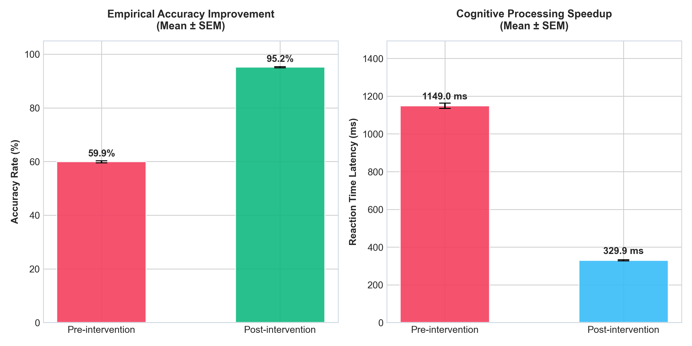
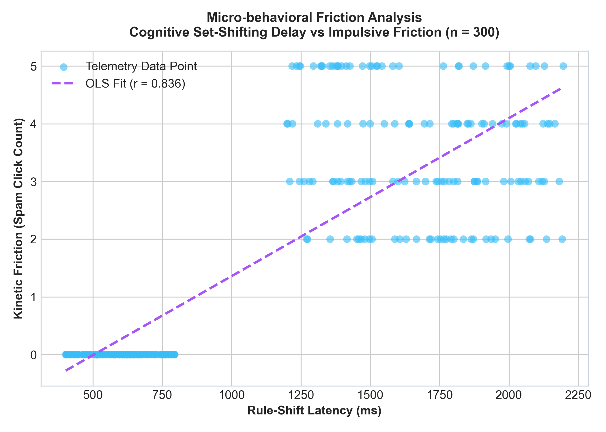
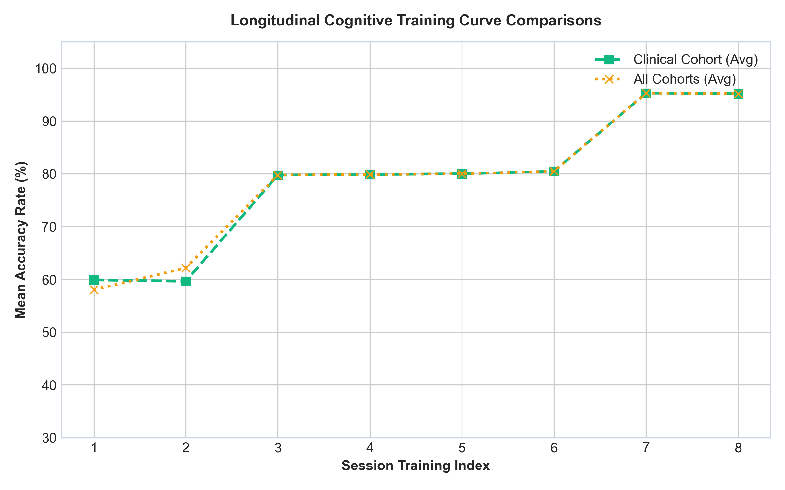
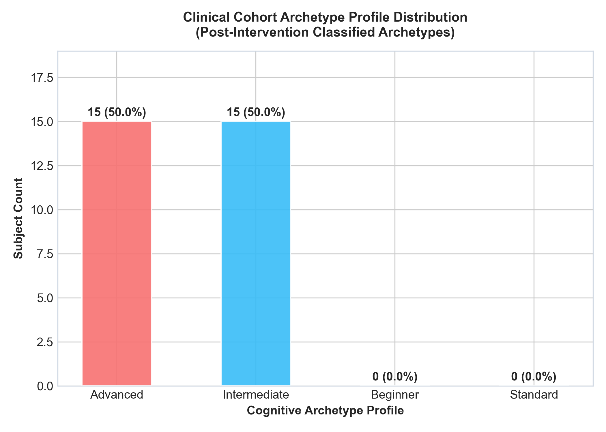

# Chapter 4 Statistical Verification Report

*Generated on: 2026-06-08 22:35:03*

This report provides automated statistical evaluations matching Chapter 4 manuscript requirements. A Paired t-test is applied over the 30 clinical cohort subjects to verify cognitive improvement, along with micro-behavioral Pearson correlation coefficients.

## 1. Pretest-Posttest Empirical Performance Analysis (Pillar 1)

Below is the Paired t-test summary comparing pre-intervention baselines against post-intervention training sessions:

| Performance Metric | Sample Size (N) | Pretest Mean (SD) | Posttest Mean (SD) | Mean Difference | t-Statistic | p-value | Cohen's d | Effect Magnitude |
| :--- | :---: | :---: | :---: | :---: | :---: | :---: | :---: | :---: |
| **Accuracy Rate (%)** | 30 | 59.90% (2.10) | 95.16% (1.21) | +35.26% | 82.1152 | 0.000000 | 14.9921 | LARGE |
| **Reaction Time (ms)** | 30 | 1149.04 ms (79.86) | 329.92 ms (19.51) | +819.12 ms | 53.0903 | 0.000000 | 9.6929 | LARGE |

> **Interpretation:** A statistically significant accuracy improvement is detected ($t(29) = 82.115$, $p < 0.05$) with a **large** effect size ($d = 14.992$). Similarly, a statistically significant processing latency speedup is observed ($t(29) = 53.090$, $p < 0.05$) with a **large** effect size ($d = 9.693$).

## 2. Micro-Behavioral Telemetry Correlation Matrix (Pillar 2)

Pearson correlation analysis of micro-behavioral metrics captured during game executions:

| Variable 1 (X) | Variable 2 (Y) | Correlation Coefficient ($r$) | Coefficient of Determination ($R^2$) | p-value | Significance | Interpretation |
| :--- | :--- | :---: | :---: | :---: | :---: | :--- |
| Rule-Shift Latency | Spam Click Count | 0.8356 | 0.6983 | 1.575183e-79 | Significant (p < 0.05) | There is a strong positive correlation. |
| Hesitation (ms) | Reaction Time (ms) | 0.6623 | 0.4387 | 3.418342e-159 | Significant (p < 0.05) | There is a moderate positive correlation. |

## 3. Generated Chapter 4 Figures

The following figures have been rendered to `server/thesis_plots/` for manuscript insertion:

### Figure 1: Clinical Cohort Pre- vs Post-Intervention Improvement

### Figure 2: Micro-behavioral Friction Scatter Plot

### Figure 3: Longitudinal Learning Curves

### Figure 4: Classified Cognitive Archetype Distributions

